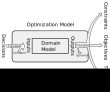

# δMOEA: Multi-Objective Grid Search Algorithm

## Executive Summary

δMOEA is an optimization library that helps people
make better decisions using their computer models of a
problem domain.  δMOEA searches the model inputs for
combinations that produce optimal model outputs with
respect to multiple objectives.  We call δMOEA a "Grid
Search" algorithm because it samples the model inputs on a
grid rather than attempting to optimize continuous values.

## Computer Models

Computer models of a problem domain express value judgments
about it.  If nothing else, what the author has chosen to
model is a statement about what is important.  Deciding to
use optimization, however, often implies an extra layer
of value judgment on top of the domain model.  We call
this extra layer the "optimization model" to distinguish
it from the domain model.  We call the inputs to
the optimization model "decisions" and the outputs
"objectives", "constraints", and "tagalongs".

Figure 1 shows how an optimization model wraps a domain
model.

