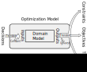
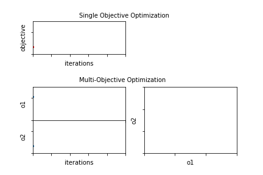

# δMOEA: Multi-Objective Grid Search Algorithm

(C) 2017 DecisionVis LLC

## Executive Summary

δMOEA is an optimization library that helps people make
better decisions using computer models of a problem domain.
δMOEA searches the model inputs for combinations that
produce optimal model outputs with respect to multiple
objectives.  We call δMOEA a "Grid Search" algorithm
because it samples the model inputs on a grid rather than
attempting to optimize continuous values.

This version of δMOEA is written in Python.

The Python version of δMOEA carries the 3-clause BSD
license.  See `COPYING.md` for details.

## Getting Started With δMOEA

1. Read the rest of this document for an overview of what
δMOEA does.
2. Read `doc/getting_started.md` for a quick guide to
downloading and using δMOEA.
3. Read `doc/tutorial.md` for a more detailed walkthrough.
4. Refer to `doc/api.md` for documentation on δMOEA's
library functions.
5. Examine the examples in `examples/` for more ways to use
δMOEA.

## Computer Models

Computer models of a problem domain express value judgments
about it.  If nothing else, what the author has chosen to
model is a statement about what is important.  Deciding to
use optimization, however, often implies an extra layer
of value judgment on top of the domain model.  We call
this extra layer the "optimization model" to distinguish
it from the domain model.  We call the inputs to
the optimization model "decisions" and the outputs
"objectives", "constraints", and "tagalongs".

Figure 1 shows how an optimization model wraps a domain
model.

* _Decisions_ are translated by the optimization model into
inputs for the domain model.
* Some domain model inputs may be held constant and not
subjected to optimization.
* Some domain model outputs are translated into _objectives_
for optimization.  Objectives are numbers that δMOEA will
attempt to minimize or maximize.
* Other domain model outputs are translated into
_constraints_ for optimization.  Constraints are numbers
that δMOEA will preemptively try to drive to zero, before
considering the objectives.
* Still other domain model outputs are captured as
_tagalongs_.  Tagalongs have no role in optimization but may
be of use for decision-making.  In addition, tagalongs
may preserve domain model inputs and outputs so that
old domain model evaluations may be reused with a new
optimization model.
* Some domain model outputs may be ignored and discarded
by the optimization model.

## Multi-Objective Optimization

Multi-Objective Optimization differs from conventional
(single-objective) optimization in that it seeks to
approximate a "Pareto Set" representing the tradeoffs among
multiple objectives, rather than to approximate a single
optimal value.  Figure 2 illustrates the difference between
the progress of single-objective and multi-objective
optimization.

Under single-objective optimization, the objective value is
continually improved over time (minimized in this example).
This is the top plot in Figure 2.  Multi-objective
optimization, on the other hand, attempts to optimize two
or more objectives at once (minimizing two objectives,
in this example.)  The bottom left plot shows both
objectives over time.  Rather than a single value, both
objectives develop a range of values that trade off against
each other.  The final tradeoff is shown in the bottom
right plot.

Figure 3 is an animated version of Figure 2 that
illustrates the progress of the optimization runs
over time, as both optimization runs converge towards
approximations of the optimal values.

## About The Name

δMOEA uses an evolutionary optimization heuristic to
improve its Pareto approximation.  This is the origin
of the "MOEA" in its name: it is a Multi-Objective
Evolutionary Algorithm.  The δ alludes to the sampling
grid in the decision space, where δ is the grid spacing.
The name δMOEA also pays homage to Deb et al.'s εMOEA, an
influential algorithm that applies a grid on the objective
space rather than the decision space.

## What Next?

Refer to `doc/getting_started.md` for an overview of how
to get and use δMOEA.
