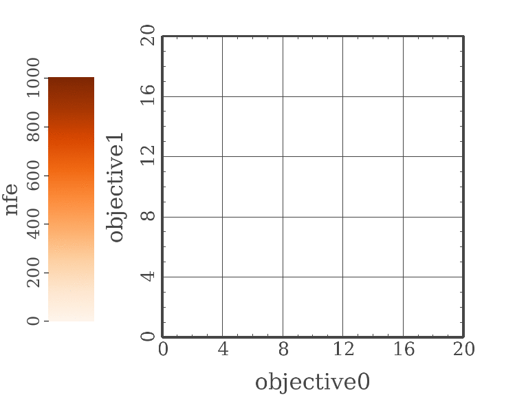

# Getting Started With δMOEA

(C) 2017 [DecisionVis LLC](http://www.decisionvis.com)

## Getting δMOEA

### For Developers

These options are recommended for developers who want to
work with the source code of δMOEA itself.

#### Clone the Repository

Use `git` to clone the repository found at:

[https://bitbucket.org/decisionvis/dmoea-python/](https://bitbucket.org/decisionvis/dmoea-python/).

The `master` branch always points at the last stable
release of δMOEA.  Releases are tagged.

#### Alternative: Download a Repository Snapshot

This option is recommended for developers who cannot use
git (or prefer not to).

Bitbucket automatically rolls up the δMOEA repository
into the archive format of your choice.  Download a
release snapshot from

[https://bitbucket.org/decisionvis/dmoea-python/downloads/?tab=tags](https://bitbucket.org/decisionvis/dmoea-python/downloads/?tab=tags)

or get any branch from

[https://bitbucket.org/decisionvis/dmoea-python/downloads/?tab=branches](https://bitbucket.org/decisionvis/dmoea-python/downloads/?tab=branches)

The disadvantage of this approach relative to cloning the
repository is that it does not preserve the commit history.

### For Users

These options are recommended for developers and users for
whom managing the δMOEA dependency is more important than
working with the source.

#### Pip

You can use `pip install dmoea` to install δMOEA.  This is
best done as a user install or within a virtualenv.
(Pip installs to system directories are a bad idea in
general.)

#### Alternative: Download a δMOEA Release Package

δMOEA releases are available as tarballs, zip files,
and Python Wheels from Bitbucket:

[https://bitbucket.org/decisionvis/dmoea-python/downloads/](https://bitbucket.org/decisionvis/dmoea-python/downloads/)

These can also be installed with pip or by extracting the
archive and running `python setup.py`.

## Example Optimization Run

The code for an example optimization run is included in
the source repository.  See
[`examples/optimize_dtlz2.py`](../examples/optimize_dtlz2.py).
It is necessary to have cloned the repository or downloaded
a snapshot to run this example as described below.

From the root directory of the δMOEA repository, execute

```
python -m examples.optimize_dtlz2 runtime.csv 0 0 1000 > result.csv
```

This uses 1000 evaluations to optimize a very difficult
instance of the DTLZ2 test problem.  This instance of
DTLZ2 applies a randomly generated rotation to 100 decision
variables.

After the run is completed, `runtime.csv` contains all
of the evaluations, and `result.csv` contains the final
Pareto approximation.  Since this instance of DTLZ2 has
two objectives, even a spreadsheet program should be
adequate to plot the evolving search population.  Open
`result.csv` and plot `objective1` against `objective0`.
DTLZ2 is a minimization problem; the curve you see
reflects the conflict between minimizing `objective0` and
`objective1`.

Now open `runtime.csv` and plot `objective1` against
`objective0`.  This shows all of the evaluations used
during optimization.  Color by `nfe` to see how δMOEA
pushes its sampling towards improved solutions.  The
animation in Figure 1 illustrates this process.



## Next Steps

<!--
### Work Through the Tutorial

Refer to [`doc/tutorial.md`](tutorial.md) and work through
the exercises there.  Read through [`doc/api.md`](api.md)
for detailed δMOEA documentation.

### Alternative: Dive in Headfirst
-->

Take `optimize_dtlz2.py` and modify it to suit your needs.
Consult [`doc/api.md`](api.md) for reference as needed.


